<!-- ══════════════════════════════════════════════════════════════════
     APPLE / VERCEL ANIMATED GLASSMORPHISM HERO BANNER
══════════════════════════════════════════════════════════════════════ -->
<picture>
  <source media="(prefers-color-scheme: dark)" srcset="./assets/dark.svg">
  <source media="(prefers-color-scheme: light)" srcset="./assets/light.svg">
  
</picture>

<!-- Profile Views Badge -->

  

 

  <picture>
    <source media="(prefers-color-scheme: dark)" srcset="https://readme-typing-svg.demolab.com?font=JetBrains+Mono&weight=600&size=22&duration=3500&pause=900&color=58a6ff&center=true&vCenter=true&width=660&height=48&lines=Turning+Data+into+Intelligent+Action+%F0%9F%A7%A0;Specializing+in+Computer+Vision+%26+Deep+Learning+%F0%9F%91%81%EF%B8%8F;Building+Predictive+ML+%26+Financial+Models+%F0%9F%93%88;M.Tech+Data+Science+Student+%F0%9F%8E%93;Open+for+Remote+AI%2FML+Internships+%F0%9F%9A%80">
    <source media="(prefers-color-scheme: light)" srcset="https://readme-typing-svg.demolab.com?font=JetBrains+Mono&weight=600&size=22&duration=3500&pause=900&color=1d4ed8&center=true&vCenter=true&width=660&height=48&lines=Turning+Data+into+Intelligent+Action+%F0%9F%A7%A0;Specializing+in+Computer+Vision+%26+Deep+Learning+%F0%9F%91%81%EF%B8%8F;Building+Predictive+ML+%26+Financial+Models+%F0%9F%93%88;M.Tech+Data+Science+Student+%F0%9F%8E%93;Open+for+Remote+AI%2FML+Internships+%F0%9F%9A%80">
    
  </picture>

 

<!-- ══════════════════ CURRENTLY WORKING ON ══════════════════ -->

## 🚀 Currently Working On

⚡ `Artificial Intelligence` &nbsp;**❯**&nbsp; Building intelligent pipelines and agents  
⚡ `Machine Learning Models` &nbsp;**❯**&nbsp; Regression, classification, and time-series forecasting  
⚡ `Computer Vision` &nbsp;**❯**&nbsp; Object detection, segmentation, and medical imaging  
⚡ `Predictive Analytics` &nbsp;**❯**&nbsp; Feature engineering and model interpretability  
⚡ `Portfolio Optimization` &nbsp;**❯**&nbsp; ML-driven financial modelling  

 

<!-- ══════════════════ TECH STACK ══════════════════ -->

## 💻 Tech Stack

  <picture>
    <source media="(prefers-color-scheme: dark)" srcset="https://skillicons.dev/icons?i=python%2Ccpp%2Cmysql%2Cpytorch%2Ctensorflow%2Csklearn%2Copencv%2Caws%2Cdocker%2Cmongodb%2Cfirebase%2Cgit%2Cvscode&theme=dark">
    <source media="(prefers-color-scheme: light)" srcset="https://skillicons.dev/icons?i=python%2Ccpp%2Cmysql%2Cpytorch%2Ctensorflow%2Csklearn%2Copencv%2Caws%2Cdocker%2Cmongodb%2Cfirebase%2Cgit%2Cvscode&theme=light">
    
  </picture>

<!-- Standardized Rectangular Badges for Libraries -->

  
  
  
  
  
  
  
  

 

<!-- ══════════════════ STATISTICS ══════════════════ -->

## 📊 Statistics

  <picture>
    <source media="(prefers-color-scheme: dark)" srcset="https://github-profile-summary-cards.vercel.app/api/cards/stats?username=helihathi&theme=github_dark">
    <source media="(prefers-color-scheme: light)" srcset="https://github-profile-summary-cards.vercel.app/api/cards/stats?username=helihathi&theme=github">
    
  </picture>
  &nbsp;&nbsp;
  <picture>
    <source media="(prefers-color-scheme: dark)" srcset="https://streak-stats.demolab.com?user=helihathi&hide_border=true&background=0d1117&stroke=1f6feb&ring=58a6ff&fire=58a6ff&currStreakNum=c9d1d9&sideNums=c9d1d9&currStreakLabel=58a6ff&sideLabels=7c9cbf&dates=6e7681">
    <source media="(prefers-color-scheme: light)" srcset="https://streak-stats.demolab.com?user=helihathi&hide_border=true&background=ffffff&stroke=bfdbfe&ring=1d4ed8&fire=1d4ed8&currStreakNum=374151&sideNums=374151&currStreakLabel=1d4ed8&sideLabels=1d4ed8&dates=6b7280">
    
  </picture>

 

<!-- ══════════════════ CONTRIBUTION ACTIVITY ══════════════════ -->

## 📈 Contribution Activity

  <picture>
    <source media="(prefers-color-scheme: dark)" srcset="https://github-readme-activity-graph.vercel.app/graph?username=helihathi&bg_color=0d1117&color=58a6ff&line=1f6feb&point=58a6ff&area=true&area_color=1f3358&hide_border=true">
    <source media="(prefers-color-scheme: light)" srcset="https://github-readme-activity-graph.vercel.app/graph?username=helihathi&bg_color=ffffff&color=1d4ed8&line=3b82f6&point=1d4ed8&area=true&area_color=dbeafe&hide_border=true">
    
  </picture>

 

<!-- ══════════════════ OPEN TO COLLABORATE ══════════════════ -->

## 🤝 Open To Collaborate & Opportunities

  
  
  
  

  
  
  

 

<!-- ══════════════════ DEV QUOTE ══════════════════ -->

## ✍️ Dev Quote of the Day

  <picture>
    <source media="(prefers-color-scheme: dark)" srcset="https://quotes-github-readme.vercel.app/api?type=horizontal&theme=dark">
    <source media="(prefers-color-scheme: light)" srcset="https://quotes-github-readme.vercel.app/api?type=horizontal&theme=light">
    
  </picture>

 

<!-- ══════════════════ CONNECT ══════════════════ -->

## 🌐 Connect With Me

  
  &nbsp;
  

 

<!-- ══════════════════ FOOTER ══════════════════ -->
<picture>
  <source media="(prefers-color-scheme: dark)" srcset="https://capsule-render.vercel.app/api?type=waving&color=0:0f3460%2C50:1a1a2e%2C100:0d1117&height=140&section=footer&text=Thanks%20for%20visiting!&fontSize=18&fontColor=90caf9&fontAlignY=65&animation=fadeIn">
  <source media="(prefers-color-scheme: light)" srcset="https://capsule-render.vercel.app/api?type=waving&color=0:93c5fd%2C50:bfdbfe%2C100:dbeafe&height=140&section=footer&text=Thanks%20for%20visiting!&fontSize=18&fontColor=1e3a5f&fontAlignY=65&animation=fadeIn">
  
</picture>
